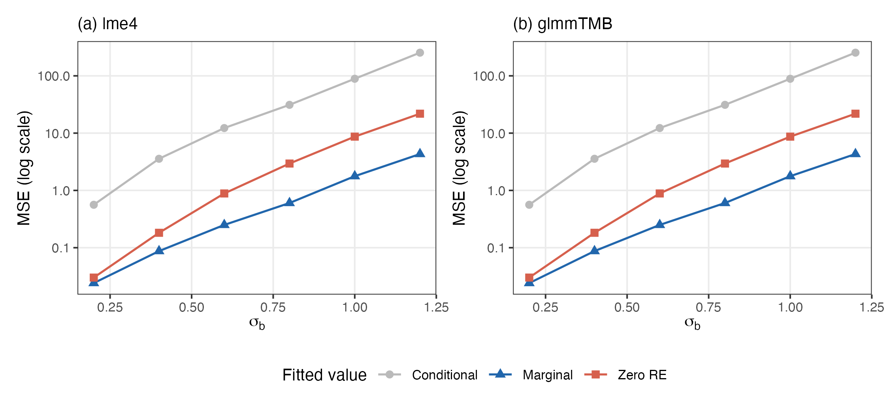

# predglmm

Marginal predictions (expected values on the response scale) for generalized
linear mixed models fitted with lme4 or glmmTMB, with parametric bootstrap
confidence intervals.

## Overview

Standard predict methods for GLMMs return either conditional predictions,
which plug in the predicted random effects, or predictions with the random
effects set to zero. Neither is the marginal mean $E(Y_i \mid X_i)$ — the
MSE-optimal predictor of $Y_i$ based on $X_i$ — which averages over the
random effects' distribution:

```math
E(Y_i \mid X_i) = \int h(\eta_i + z_i^\top b) \, \varphi(b; 0, \Psi) \, db,
```

where $h$ is the inverse link function, $\eta_i = x_i^\top \beta$ is the
linear predictor, $z_i$ is the random effects design vector, and
$\varphi(\cdot; 0, \Psi)$ is the random effects density. When $h$ is
nonlinear, $E[h(\eta + z^\top b)] \neq h(\eta)$ in general, so
zero-RE predictions are biased for the marginal mean, and the bias grows
with the random effect variance.

`predglmm` computes the integral analytically for the identity, log, and
square-root links, and by Gauss–Hermite quadrature for any
other link, including user-supplied inverse links.

The figure shows the mean squared error of the three prediction types
against the true marginal mean $\exp(\beta + \sigma_b^2/2)$ in an
intercept-only Poisson GLMM with log link, as the random effect standard
deviation $\sigma_b$ grows (300 replications per point; code in
[sim_mse.R](sim_mse.R)):



Marginal predictions have the smallest error throughout, in line with the
theory. Zero-RE predictions estimate $\exp(\beta)$ instead of the marginal
mean, so their error grows with $\sigma_b$; conditional predictions track
individual subjects, not the marginal mean.

## Installation

```r
devtools::install_github("koekvall/predglmm")
```

## Marginal predictions

```r
library(glmmTMB)
library(lme4)
library(predglmm)

# Poisson GLMM, log link: closed-form marginal predictions
fit_tmb <- glmmTMB(count ~ mined + (1 | site),
                   family = poisson, data = Salamanders)
fit_lme4 <- glmer(count ~ mined + (1 | site),
                  family = poisson, data = Salamanders)

pred_glmmtmb(fit_tmb)[1:5]
pred_glmer(fit_lme4)[1:5]

# The usual prediction functions do not give marginal means:
predict(fit_tmb, type = "response")[1:5]               # REs plugged in
predict(fit_tmb, type = "response", re.form = NA)[1:5] # REs set to zero
```

Links without a closed form use quadrature automatically; nothing changes in
the call:

```r
fit_bin <- glmmTMB(I(count > 2) ~ mined + (1 | site),
                   family = binomial, data = Salamanders)
pred_glmmtmb(fit_bin)[1:5]
```

## Bootstrap confidence intervals

`boot_pred` computes parametric bootstrap confidence intervals for the
marginal predictions, or for any function of them. Responses are simulated
from the fitted model, the model is refit to each simulated response, and
the statistic is recomputed from each refit's marginal predictions.

```r
# CIs for every marginal prediction
b <- boot_pred(fit_tmb, n_boot = 1000, seed = 1)
print(b)

# CI for a function of the predictions: difference in mean predictions
# between mined and unmined sites. The statistic receives the data the
# model was fit to with a column `pred` of marginal predictions, so it can
# also use variables that do not appear in the model formula.
mined_diff <- function(data) {
  m <- tapply(data$pred, data$mined, mean)
  c("yes-no" = unname(m["yes"] - m["no"]))
}
boot_pred(fit_tmb, statistic = mined_diff, n_boot = 1000, seed = 1)
```

All refits happen once regardless of how many quantities the statistic
returns, so adding comparisons does not add computing time. Refits with a
variance component estimated at zero are kept and counted; see
`?boot_pred` for the screening rules and further details.

## Scope

- **lme4**: `pred_glmer()` for `glmer()` and `lmer()` fits
- **glmmTMB**: `pred_glmmtmb()` for `glmmTMB()` fits, including dispersion
  families (e.g., nbinom1, nbinom2), zero inflation, and truncated families
- Offsets are supported for both backends
- **Links**: identity, log, and square-root in closed form; any other link,
  including custom inverse links, via Gauss–Hermite quadrature

See `vignette("predglmm")` for a worked example with a multi-phase
longitudinal design.

## License

MIT. Provided without warranty of any kind.
